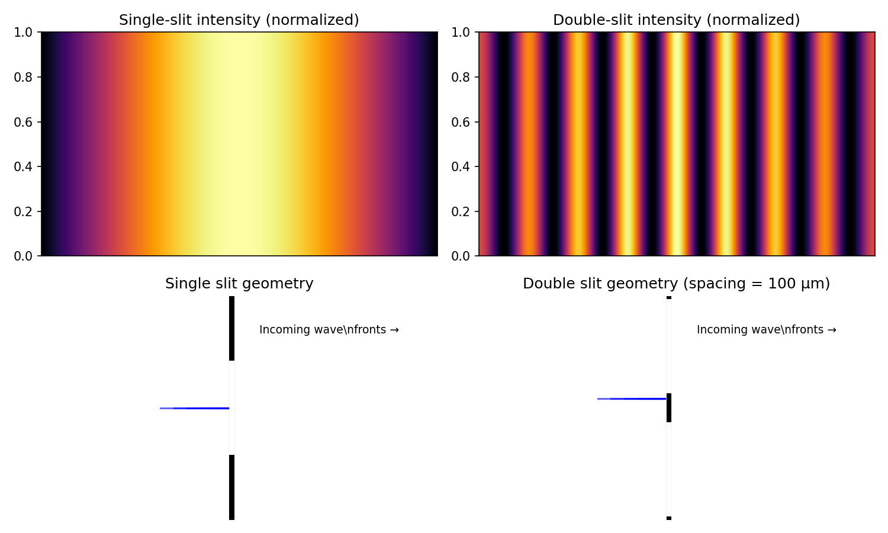
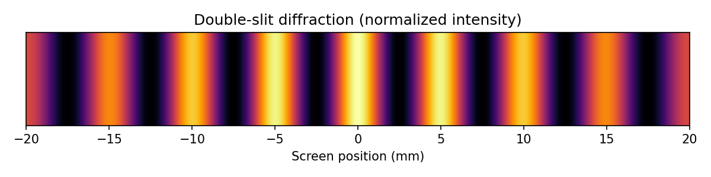
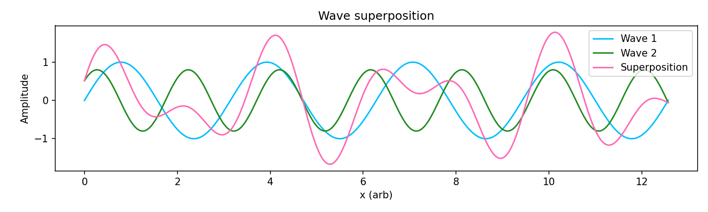

# Diffraction-Superposition-Simulation

Interactive C++ simulation of diffraction and wave superposition phenomena. This repository contains two C++/CLI Windows Forms components (`Diffraction` and `Superposition`) and small Python utilities to generate and preview static and interactive visuals derived from the same physics concepts.

---

## Diffraction.h

Overview
- `Diffraction` is a WinForms `Form` that visualises multiple-slit diffraction. The form renders incoming wavefronts, a barrier with one or two slits, and diffracted wavefront arcs from discrete source points along each slit. The UI exposes sliders and text inputs to change wavelength, slit height and slit spacing, plus buttons to add/reset slits and apply custom values.

Key functions & members
- `Diffraction()` (constructor)
  - Calls `InitializeComponent()`, sets defaults (`slitHeight`, `wavelength`), enables double buffering and starts `timer1` for animation.
- `void InitializeComponent()`
  - Designer-generated code that constructs and wires these controls: `trackBar1` (wavelength), `trackBar2` (slit height), `trackBar3` (slit spacing), `textBox1`/`textBox2` (custom inputs), `button1` (refresh), `button2` (add slit), `button3`/`button4` (apply values), `timer1`, and labels/tooltips.
- `virtual void OnPaint(PaintEventArgs^ e) override`
  - The central rendering routine:
    - Draws incoming straight wavefronts as vertical lines spaced by the selected wavelength.
    - Draws the barrier and one or two white slit openings in a black barrier rectangle.
    - For each slit, samples `numSources` points along the slit height and draws short circular arcs from each source point to visualize diffraction spreading across the screen.
    - Uses `phaseShift` to offset wavefronts for animation and reads UI values (trackbars) to determine pixel wavelength, slit height/spacings, and drawing density.
- Event handlers and helpers
  - `trackBar1_Scroll`: update `wavelength` and label text.
  - `trackBar2_Scroll`: update `slitHeight` and label text.
  - `trackBar3_Scroll`: update slit spacing label.
  - `timer1_Tick`: advance `phaseShift` and call `Invalidate()` to animate.
  - `button1_Click`: reset UI to defaults and hide second slit.
  - `ToggleSecondSlit` / `button2_Click`: toggle `showSecondSlit` and repaint.
  - `button3_Click` / `button4_Click`: parse and apply custom values from `textBox1` / `textBox2`.

Important fields
- `double wavelength` — wavelength used for rendering (set from UI, internally converted to meters).
- `double slitHeight` — slit height used to compute discrete source positions along the aperture.
- `double phaseShift` — used to shift incoming wavefronts across frames for animation.
- `bool showSecondSlit` — toggle for displaying/using a second slit.
- UI references: `TrackBar^ trackBar1/2/3`, `Timer^ timer1`, `TextBox^ textBox1/2`, `Button^ button1..4`.

Notes
- The `OnPaint` logic is an educational, visual representation (discrete source arcs) rather than a full numerical Fresnel/Fraunhofer solver. It is tuned to produce clear animated visuals similar to the original WinForms demo.

---

## Superposition.h

Overview
- `Superposition` is a WinForms `Form` that visualises two 1D waves and their superposition. It draws two individual waves and their combined waveform on a grid; supports toggling each wave, animating them, and editing amplitudes, frequencies, and phases.

Key functions & members
- `Superposition()` (constructor)
  - Calls `InitializeComponent()`, sets defaults for amplitudes, frequencies, phases, and sets up `animationTimer` for timed updates.
- `void InitializeComponent()`
  - Designer code creating `HScrollBar` controls, `CheckBox` toggles, `TextBox` fields for numeric entry, panels for layout, and wiring event handlers.
- `void OnResize(Object^ sender, EventArgs^ e)`
  - Triggers `Invalidate()` to repaint when the window size changes.
- `void OnPaint(PaintEventArgs^ e) override`
  - Draws a grid determined by `gridRows` and `gridColumns`.
  - Renders Wave 1 and Wave 2 independently (if their checkboxes are checked) by sampling per-pixel line segments and drawing small line segments between successive points.
  - When the Superposition checkbox is active, computes the summed waveform using helper `waveSup(...)` and draws it.
  - Uses `globalTimewave1`/`globalTimewave2` offsets when `animatingwave1`/`animatingwave2` are set to produce animation.
- `OnAnimationTick` (timer)
  - Increments `globalTimewave1`/`globalTimewave2` when corresponding animations are active and calls `Invalidate()`.

Important fields
- `double amplitude1, amplitude2`, `double frequency1, frequency2`, `double phase1, phase2` — wave parameters.
- `double globalTimewave1, globalTimewave2` and `Timer^ animationTimer` — animation timing and offsets.
- `int gridRows, gridColumns` — grid layout for the plot area.
- UI references: `HScrollBar^ hScrollBar1..6`, `CheckBox^` controls (`interferencecheckbox`, `standingwavecheckbox`, `beatscheckbox`), `Panel^ panel1/panel2`, `TextBox^` fields.

Notes
- The wave drawing is pixel-by-pixel and optimized for clarity and interactivity. For numerical analysis you may extract or reimplement `wave`/`waveSup` math in a numeric library.

---

## Visuals & Interactive Demo

This repository includes generated visuals and a simple interactive demo to explore single-slit and double-slit diffraction.

### Annotated image


### Static images



Physics explanation 

- Single-slit diffraction: a finite slit width produces a diffraction envelope described by a $sine^2$ term. The first minima approximately satisfy $a\sin\theta = m\lambda$ (integer $m$), where $a$ is the slit width and $\lambda$ the wavelength.

- Double-slit interference: two coherent slits separated by distance $d$ produce interference fringes given by $d\sin\theta = n\lambda$ (integer $n$). The observed pattern is the interference fringes modulated by the single-slit envelope: bright fringes occur where path differences equal integer wavelengths, but their amplitude follows the single-slit envelope.

Interactive demo

Run the interactive demo (matplotlib) locally to explore slit spacing and toggle a second slit:

```bash
python3 scripts/interactive_diffraction.py
```

The interactive window provides a slider for slit spacing (μm), a checkbox to toggle the second slit, and a button to save a PNG snapshot.

How to reproduce visuals

```bash
python3 -m pip install --user numpy matplotlib
python3 scripts/generate_annotated_diffraction.py
python3 scripts/render_visuals.py
```

To run the interactive demo:

```bash
python3 scripts/interactive_diffraction.py
```

---

Files of interest

- `Diffraction.h`, `Superposition.h` — C++/CLI WinForms components (UI + rendering)
- `scripts/interactive_diffraction.py` — interactive matplotlib demo (slider + toggle)
- `scripts/generate_annotated_diffraction.py` — annotated figure generator
- `scripts/render_visuals.py` — quick renderer for static images
- `images/` — generated PNGs (diffraction, annotated, superposition)
# Diffraction-Superposition-Simulation
 Interactive C++ simulation of diffraction and superposition phenomena, implementing computational physics models with real-time visualisation.
# Diffraction-Superposition-Simulation

Interactive C++ simulation of diffraction and superposition phenomena, implementing computational physics models with real-time visualisation.

---

## Diffraction.h

Summary
- Purpose: `Diffraction` is a C++/CLI Windows Forms `Form` that simulates multiple-slit diffraction and provides interactive controls for wavelength, slit height, spacing, and toggles for adding a second slit.
- Key rendering: `OnPaint(PaintEventArgs^ e)` — draws incoming wavefronts, slit barrier(s), and diffracted arcs.
- Interaction: trackbars and buttons wired in `InitializeComponent()` control parameters and animation.

## Superposition.h

Summary
- Purpose: `Superposition` is a C++/CLI Windows Forms `Form` that visualizes two waves and their superposition, supports animation, and exposes UI controls for amplitudes, frequencies, phases, and toggles.

---

## Visuals & Interactive Demo

This repository includes generated visuals and a simple interactive demo to explore single-slit and double-slit diffraction.

### Annotated image


### Static images


Physics explanation 

- Single-slit diffraction: a finite slit width produces a diffraction envelope described by a $sin^2$ term. The first minima approximately satisfy $a\sin\theta = m\lambda$ (integer $m$), where $a$ is the slit width and $\lambda$ the wavelength.

- Double-slit interference: two coherent slits separated by $d$ produce interference fringes given by $d\sin\theta = n\lambda$ (integer $n$). The observed pattern is the interference fringes modulated by the single-slit envelope: bright fringes occur where path differences equal integer wavelengths, but their amplitude follows the single-slit envelope.

Interactive demo

Run the interactive demo (matplotlib) locally to explore slit spacing and toggle a second slit:

```bash
python3 scripts/interactive_diffraction.py
```

The interactive window provides a slider for slit spacing (μm), a checkbox to toggle the second slit, and a button to save a PNG snapshot.

---

How to reproduce visuals

```bash
python3 -m pip install --user numpy matplotlib
python3 scripts/generate_annotated_diffraction.py
python3 scripts/render_visuals.py
```

To run the interactive demo:

```bash
python3 scripts/interactive_diffraction.py
```

---

Files of interest

- `Diffraction.h`, `Superposition.h` — C++/CLI WinForms components
- `scripts/interactive_diffraction.py` — interactive matplotlib demo
- `scripts/generate_annotated_diffraction.py` — annotated figure generator
- `scripts/render_visuals.py` — quick renderer for static images
- `images/` — generated PNGs (diffraction, annotated, superposition)
